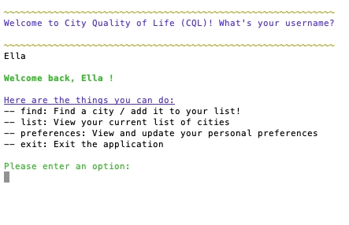

# Welcome to CQL (City – Quality of Life!)

CQL is a Ruby-based CLI program that allows users to search and browse a variety of quality of life (QOL) metrics on different cities.

Do you want to move to a new city? Are you curious about you how your current city measures up? CQL is here to help you decide which city you should call home.

Data provided by [Teleport](https://developers.teleport.org )

## Installation

* Install Ruby 2.6.1 on your local computer
* Fork the repository from https://github.com/bureaucratix/guided-module-one-project-assessment-seattle-web-career-042219
* Clone the repository into a directory of your choice with
`git clone https://github.com/bureaucratix/guided-module-one-project-assessment-seattle-web-career-042219`
* Navigate to the directory with `cd guided-module-one-project-assessment-seattle-web-career-042219`
* Run `bundle install`
* Create the program tables `rake db:migrate`
* Run the program by `ruby bin/run.rb`

## Navigating the Program
CQL prompts you to enter a username to begin the application:
* if you are a new user, enter a new username
* if you are a returning user, enter your username

Once you are signed in, you will have a few options to choose from the main menu.

Enter the option you wish by typing in the key word (i.e "find", "list", "preferences").

You can also enter "exit" to quit the program!

<!-- #UPDATE THIS IMAGE!!!! -->

### navigating find

Users can enter a city name to search QOL metric values (a numerical score out of 10). Once you enter a city name, the program outputs a list of cities with similar matches so you can select the one you intended!

 ** Please note that the program limits return choices to 25 cities. Type the full name of the city to help the search function 👍🏻

 

Quality of life metrics data are available for major urban areas. If users select a suburb city, they receive the quality of life metrics for the greater urban area that the suburb belongs to as displayed below.

 

Users can choose to add the city to their short list to save for later!

### navigating list

Users can view their current short list of cities they saved at any time by typing "list" from the main menu.

Within this features users can compare the cities they have saved in their short list by each of the 17 QOL metrics.

![list] (images/list.png)
![list_2] (images/list_2.png)

Users can also remove individual cities from their list of saved cities or they can delete the entire short list.

### navigating preferences

(Optional)
Users can add and update preferences for each of the 17 QOLs based on a 5 point scale:

* 1 = Not at all important
* 2 = Slightly important
* 3 = Somewhat important
* 4 = Very important
* 5 = Absolutely Vital!

## Features Summary

These are the key features and functionality built into the program:

* Search for cities by name and view quality of life metrics--search results return potential matches, users can confirm intended city by: city name and state.
* Ability to add cities to a user's short list of potential cities they are considering.
* Ability to view city short list, delete individual cities, or delete the entire list.
* Ability to compare cities that they have saved on each of the 17 quality of life metrics.
* Ability to add, view, and update user preferences for all the quality of life metrics in their profile.

## Demo

https://youtu.be/g39hqQYoLto

## Credits
Project by Alex Kitelinger and Ella Taber

source "https://rubygems.org"

gem 'sinatra-activerecord'

gem 'sqlite3'

gem 'pry'

gem 'rest-client'

gem 'json'

gem "require_all"

gem 'colorize'

gem 'tty-prompt'

gem 'tty-table'
